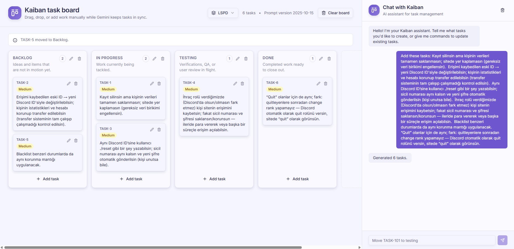

# Kaiban
AI-powered Kanban automation that turns natural language into actionable board updates.



## Overview
Kaiban pairs a Next.js 16 App Router frontend with Gemini-driven function calls. Conversational input becomes structured task data that remains synchronized across boards, chat transcripts, and Prisma-backed storage. Users can create, update, reorganize, or remove tasks, boards, and columns either through the UI or conversational commands.

## Architecture
- **Frontend:** `app/page.tsx` renders the board, task drawer, and resizable chat sidebar. Hooks such as `use-board-manager`, `use-task-manager`, and `use-chat-manager` coordinate board state, task mutations, and chat interactions.
- **Backend:** App Router endpoints under `app/api/**` handle task, board, column, chat, and data fetch workflows. Shared persistence logic lives in `lib/api/*` helpers.
- **AI Integration:** `lib/gemini.ts` wraps Gemini calls using the schemas defined in `lib/gemini-contract.ts`, guaranteeing deterministic function-call results that mirror the Prisma models.
- **Data Layer:** Prisma models (`prisma/schema/*.prisma`) store conversations, boards, columns, and notes, tying every change back to a conversation history.

## Getting Started
```bash
pnpm install
pnpm prisma migrate dev
pnpm dev
```
Visit `http://localhost:3000` once the dev server starts. UI routes belong under `app/`; shared utilities reside in `components`, `hooks`, and `lib`.

## Environment Variables
- `DATABASE_URL`: PostgreSQL connection string used by Prisma.
- `GEMINI_API_KEY` or `GOOGLE_GEMINI_API_KEY`: API key for Gemini function calling.
- `GEMINI_MODEL` (optional): Overrides the default `gemini-2.5-flash` model.

## Database Schema
- **Board / BoardColumn:** Boards own ordered columns and optional relationships to the originating conversation.
- **Conversation / ConversationMessage:** Track chat history and metadata for every assistant exchange.
- **Note:** Represents an actionable task with `caseNumber`, `status`, and `priority`; optionally scoped to a board and conversation.
Run `pnpm prisma migrate dev` to apply schema changes locally.

## Key Workflows
- **Board lifecycle:** `use-board-manager` loads boards from `GET /api/data`, creates boards via `POST /api/boards`, renames through `PATCH /api/boards/[id]`, deletes with `DELETE /api/boards/[id]`, and clears tasks using `POST /api/boards/[id]/clear`.
- **Task lifecycle:** Tasks originate from chat-created Gemini calls or manual edits. Mutations hit `POST /api/create-board`, `POST /api/chat`, `POST /api/update-task`, `POST /api/delete-task`, and `PATCH /api/tasks/[caseNumber]`.
- **Chat automation:** `POST /api/chat` enriches user commands with next task numbers, calls Gemini, and executes the resulting function handlers defined in `lib/api/chat-handler.ts`.

## API Contracts
- `POST /api/create-board`
  - **Body:** `{ text: string, boardId?: string }`
  - **Success:** `{ tasks: Task[], conversationId: string, boardId: string | null }`
- `POST /api/chat`
  - **Body:** `{ command: string, conversationId: string, boardId?: string }`
  - **Success:** Action payload describing created tasks, status updates, deletions, or board/column mutations.
- `POST /api/update-task`
  - **Body:** `{ command: string, conversationId: string }`
  - **Success:** `{ caseNumber: string, newStatus: string }`
- `POST /api/delete-task`
  - **Body:** `{ command: string, conversationId: string }`
  - **Success:** `{ caseNumber: string }`
- `PATCH /api/tasks/[caseNumber]`
  - **Body:** `{ newCaseNumber?, title?, description?, priority? }`
  - **Success:** `{ caseNumber, title, description, status, priority }`
- `GET /api/boards`
  - **Success:** `{ boards: Array<{ id, name, title, taskCount, columns[] }> }`
- `POST /api/boards`
  - **Body:** `{ name: string, columns?: Array<{ title: string, helper?: string, order: number }> }`
  - **Success:** `{ board: { id, name, title, columns[] } }`
- `PATCH /api/boards/[id]`
  - **Body:** `{ name: string }`
  - **Success:** `{ board: { id, name, title, columns[] } }`
- `DELETE /api/boards/[id]`
  - **Success:** `{ success: true }`
- `POST /api/boards/[id]/clear`
  - **Success:** `{ clearedCount: number }`
- `GET /api/data`
  - **Query:** `?boardId=<id>` (optional)
  - **Success:** `{ conversations, tasks, boards }`
- `POST /api/clear-messages`
  - **Body:** `{ conversationId: string }`
  - **Success:** `{ success: true }`

## Gemini Function Contracts
`lib/gemini-contract.ts` defines strict schemas for Gemini outputs:
- `create_tasks_from_text`: Returns `{ tasks: Array<{ caseNumber, title, description, status, priority }> }`.
- `update_task_status`: Returns `{ caseNumber, newStatus }` mapping conversational intent to board statuses.
- `delete_task`: Returns `{ caseNumber }` to remove tasks.
- `update_task_properties`: Renames or edits task metadata via `{ caseNumber, newCaseNumber?, newTitle?, newDescription?, newPriority? }`.
- `create_board`, `update_board`, `delete_board`: Manage board lifecycle with confirmation handling.
- `create_column`, `update_column`, `delete_column`: Maintain column structure for the active board.

## Development Workflow
- `pnpm typecheck`: Type-safety gate (required before merging changes).
- `pnpm build`: Produces a production bundle (optional for local verification).
- `pnpm prisma studio`: Opens Prisma Studio to inspect boards, notes, and conversations.
